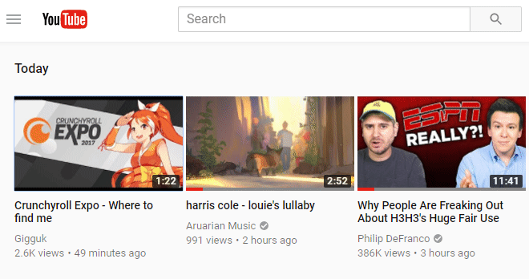

# Domscriptions 
> Easily mark (without hiding!) your YouTube subscriptions.

This extension lets you <kbd>ALT</kbd>+<kbd>CLICK</kbd> video thumbnails on your [subscriptions feed](https://youtube.com/feed/subscriptions) to toggle tinting them a darker shade of color. Useful for people that have a lot of subscriptions and like making their own visual cues.

## Features & Limitations
* ✅ **Cloud sync** - Persist your marked videos across different sessions/computers!
* ✅ **Custom colors** - Customize the color you want videos to be tinted with!
* ❌ **Single account** - Logging into another account will wipe your marked videos.
* ❌ **Grid only** - List view on the subscriptions page is unsupported.

## Developing
You'll need [git](https://git-scm.com/downloads) and [node](https://nodejs.org/en/download/).
1. Get the code: `git clone https://github.com/bcanseco/domscriptions.git`
2. Navigate to it: `cd domscriptions`
3. Grab the dependencies: `npm install`
4. Build the code, run the tests, hot reload on changes: `npm run gulp`
